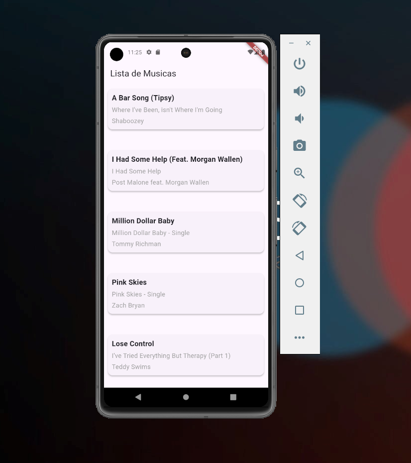

# Lista de músicas

Este projeto é um artefato para o desafio técnico em Flutter. O projeto tem como objetivo demonstrar os conceitos de programação, como o consumo de APIs externas. Para a realização do projeto foi utilizado uma API pública de músicas, onde as mesmas são listadas de forma simples.

## Como utilizar

Após realizar o clone do projeto, deverá ser executado:

### `flutter pub get`
Atualiza as dependências do projeto

### `Abra um emulador de sua preferência`

### `CTRL + F5`
executa o projeto

## Projeto

      

Foram realizadas as seguintes implementações:

- Consumo de API - musixmatch;
- Tratamento de dados e exceptions;
- SRP Princípio da Responsabilidade Única - Solid;
- Listagem de dados tratados na tela;
- Sistema de loading enquanto os dados são carregados;

  OBS: Se a APIKEY estiver inválida, será necessário criar um cadastro no site da API, ir em sua conta e resgatar sua chave. Após isso deverá substituir no caminho "lib/data/repositories/music_repository.dart" no campo "apikey=" da url.

### Referências

Princípio da Responsabilidade Única: https://www.campuscode.com.br/conteudos/s-o-l-i-d-principio-da-responsabilidade-unica

Documentação Flutter: https://docs.flutter.dev/

Como consumir API em flutter: https://medium.com/flutter-comunidade-br/flutter-como-consumir-uma-api-rest-e4bfbba91fd2

API utilizada: https://developer.musixmatch.com/?ref=public_apis

